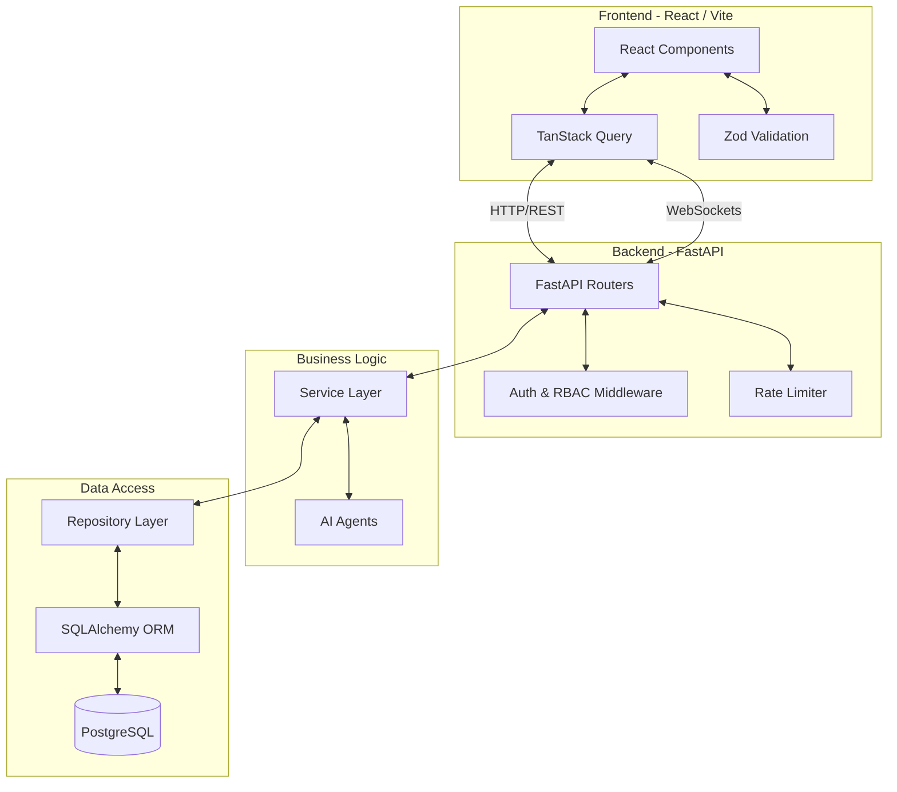

# FounderOS 🚀

FounderOS is an all-in-one startup operating workspace designed for founders to manage venture portfolios, track strategic goals, execute tactical milestone tasks, and consult with specialized AI agents including a strategic AI Co-Founder.

---

## 📐 System Architecture



---

## 🛠️ Technology Stack

### Backend
- **Core**: Python 3.11+, [FastAPI](https://fastapi.tiangolo.com/)
- **Architecture**: Service/Repository Pattern
- **ORM & Database**: [SQLAlchemy](https://www.sqlalchemy.org/), PostgreSQL
- **Validation**: Pydantic v2 (Strict Typing), Pydantic Settings
- **Testing**: PyTest
- **Security**: JWT (Jose), Passlib (Bcrypt), Custom Rate Limiting

### Frontend
- **Core**: React 18, [Vite](https://vitejs.dev/)
- **State & Caching**: TanStack Query (React Query)
- **Validation**: Zod
- **Testing**: Vitest, Playwright (E2E)
- **Styling**: Vanilla CSS with custom glassmorphism design variables

---

## 💡 Design Decisions & Trade-offs

1. **Service-Repository Pattern**: The backend separates HTTP routing (Controllers), business logic (Services), and database interactions (Repositories). This makes the application highly testable and loosely coupled.
2. **TanStack Query**: Chosen over standard `useEffect` for data fetching to provide robust caching, loading states, and automatic background refetching without complex Redux boilerplate.
3. **Zod Validation**: Used on the frontend to ensure that data conforms to expected shapes *before* being sent to the backend, catching errors early and reducing API load.
4. **PyTest & Playwright**: Ensures stability across the full stack. E2E tests guarantee critical user flows (Login, Goal Creation) function as expected.

---

## 📂 Repository Structure

```bash
FounderOS/
├── backend/                  # FastAPI Application
│   ├── agents/               # Specialized AI Agents
│   ├── controllers/          # API Routers (HTTP layer)
│   ├── services/             # Business Logic Layer
│   ├── repositories/         # Database Access Layer
│   ├── database/             # SQLAlchemy setup
│   ├── models/               # DB schemas (SQLAlchemy)
│   ├── schemas/              # Pydantic schemas (Validation)
│   ├── middleware/           # CORS, Rate Limiting, tracing
│   ├── tests/                # Pytest unit & integration tests
│   ├── config.py             # Environment configurations
│   ├── requirements.txt      # Python dependencies
│   └── app.py                # Server entrypoint
├── frontend/                 # React Frontend App
│   ├── src/
│   │   ├── api/              # Axios instance configuration
│   │   ├── components/       # UI & Feature components
│   │   ├── pages/            # Core views
│   │   ├── App.jsx           # App routes and auth guards
│   │   └── main.jsx          # TanStack Query Provider
│   ├── tests/                # Playwright E2E & Vitest unit tests
│   ├── package.json          # Node dependencies
│   └── vite.config.js        # Vite config
└── .github/workflows/        # CI/CD Pipeline
```

---

## 🚀 Setup & Installation

### Prerequisites
- Python 3.11+
- Node.js 20+
- PostgreSQL

### Backend Setup
1. Navigate to the backend directory:
   ```bash
   cd backend
   ```
2. Create and activate a Python virtual environment:
   ```bash
   python -m venv venv
   # On Windows:
   .\venv\Scripts\activate
   # On macOS/Linux:
   source venv/bin/activate
   ```
3. Install the dependencies:
   ```bash
   pip install -r requirements.txt
   ```
4. Create a `.env` file in the `backend/` directory:
   ```env
   DATABASE_URL=postgresql://<username>:<password>@localhost:5432/founderos
   ENVIRONMENT=dev
   SECRET_KEY=your_super_secret_key
   GROQ_API_KEY=your-api-key-here
   ```
5. Run the tests to ensure the environment is healthy:
   ```bash
   pytest
   ```
6. Start the FastAPI development server:
   ```bash
   uvicorn app:app --reload
   ```

### Frontend Setup
1. Navigate to the frontend directory:
   ```bash
   cd frontend
   ```
2. Install npm dependencies:
   ```bash
   npm install
   ```
3. Run the unit tests:
   ```bash
   npm test
   ```
4. Run the frontend development server:
   ```bash
   npm run dev
   ```
5. Open your browser and navigate to `http://localhost:5173`.

### E2E Testing
To run the Playwright E2E tests:
```bash
cd frontend
npx playwright test
```

---

## Live Demo Guide
Click the link down below:-
1. https://founder-os-frontend-kappa.vercel.app
2. Sign Up
3. Manage
